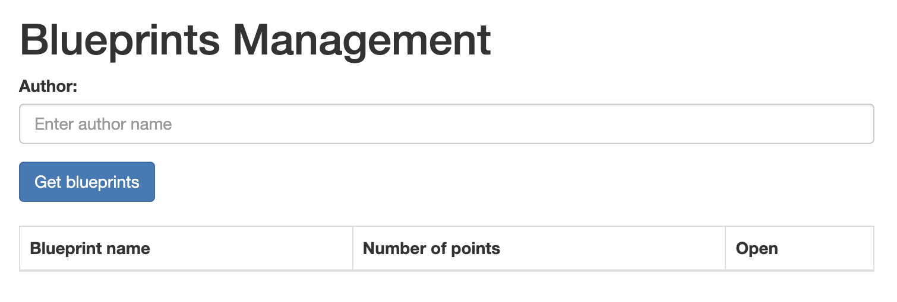
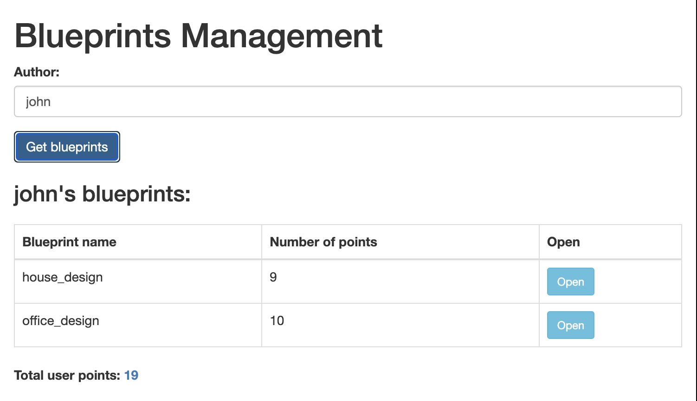
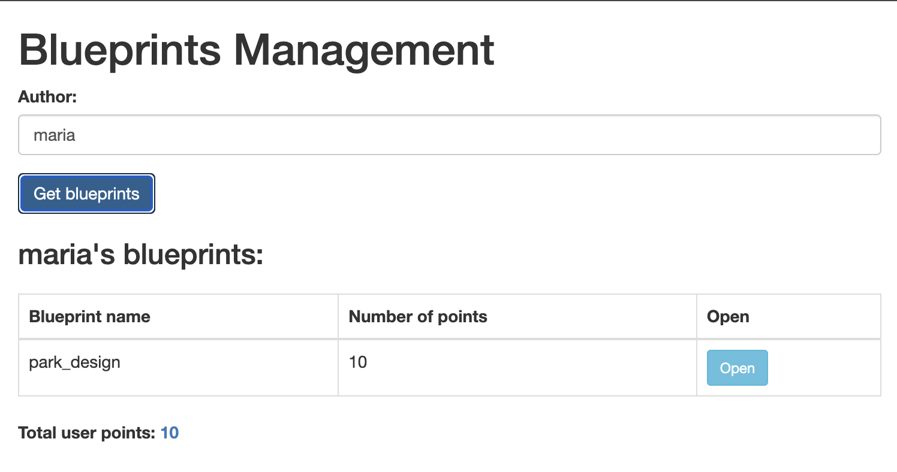
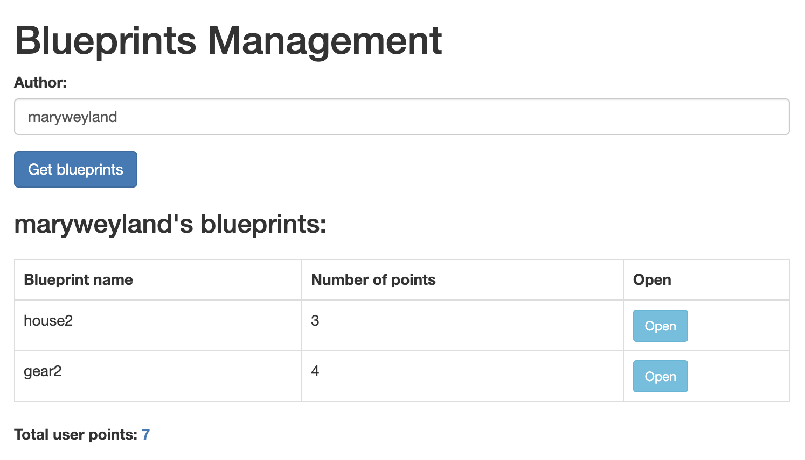
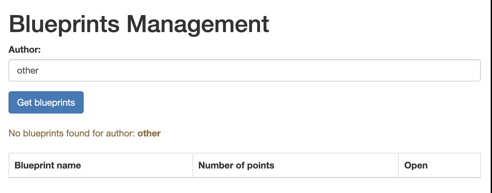
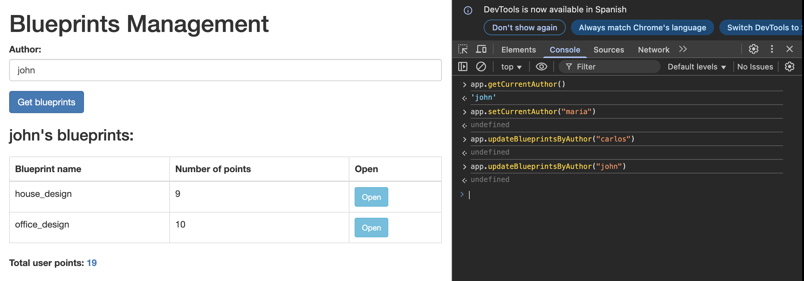

# 🌐 HTML5/JS REST Client - Blueprints Management System (ARSW)

## 👥 **Team Members**

- [Jesús Alfonso Pinzón Vega](https://github.com/JAPV-X2612)
- [David Felipe Velásquez Contreras](https://github.com/DavidVCAI)

---

## 📚 **Laboratory Overview**

This laboratory focuses on building a **fat client** (thick client) web application using **HTML5**, **JavaScript**, **CSS3**, and **jQuery** that consumes a **REST API** built with *Spring Boot*. The main objective is to create a dynamic single-page application that manages architectural blueprints, demonstrating modern web development patterns and API integration techniques.

### 🎯 **Learning Objectives**

- ✅ Understanding the **Module Pattern** in JavaScript for encapsulation
- ✅ Implementing **AJAX communication** with REST APIs
- ✅ **DOM manipulation** using jQuery selectors and methods
- ✅ Applying **functional programming** concepts (map, reduce, callbacks)
- ✅ Managing **application state** in the frontend
- ✅ Working with **WebJars** for dependency management in Spring Boot
- ✅ Implementing **event-driven** user interfaces
- ✅ **JSON data processing** and transformation
- ✅ Building **responsive layouts** with Bootstrap 3

---

## 🏗️ **Architecture Overview**

### 📋 **System Architecture**

The application follows a **client-server architecture** with clear separation between frontend and backend:

```
┌─────────────────────────────────┐
│      Web Browser (Client)       │
│   ┌─────────────────────────┐   │
│   │      index.html         │   │
│   │   (View Layer - UI)     │   │
│   └──────────┬──────────────┘   │
│              │                  │
│   ┌──────────▼──────────────┐   │
│   │       app.js            │   │
│   │  (Controller/Module)    │   │
│   │  - State Management     │   │
│   │  - Business Logic       │   │
│   └──────────┬──────────────┘   │
│              │                  │
│   ┌──────────▼──────────────┐   │
│   │     apimock.js          │   │
│   │   (Mock API Layer)      │   │
│   │  - Simulated Data       │   │
│   └─────────────────────────┘   │
└─────────────────────────────────┘
          │ HTTP/JSON
          │ (Future: Real API)
┌─────────▼─────────────────────┐
│   Spring Boot REST API        │
│   - BlueprintAPIController    │
│   - BlueprintsServices        │
│   - InMemoryPersistence       │
└───────────────────────────────┘
```

### 🎨 **Frontend Architecture**

**Module Pattern Implementation:**
- **Private State**: Encapsulated variables (`currentAuthor`, `currentBlueprints`)
- **Public API**: Exposed functions for view interaction
- **Callback Pattern**: Asynchronous data handling
- **Event-Driven**: User interactions trigger controller methods

---

## ⚙️ **Prerequisites & Setup**

### 🔧 **Technologies Used**

**Backend:**
- *Java 17*
- *Spring Boot 2.7.18*
- *Maven 3.6+*
- *WebJars* (jQuery 3.1.0, Bootstrap 3.3.7)

**Frontend:**
- *HTML5*
- *CSS3* (Bootstrap 3.3.7)
- *JavaScript ES5+*
- *jQuery 3.1.0*

### 📦 **Dependencies Configuration**

**Maven Dependencies (pom.xml):**

```xml
<!-- WebJars for frontend libraries -->
<dependency>
    <groupId>org.webjars</groupId>
    <artifactId>webjars-locator</artifactId>
    <version>0.45</version>
</dependency>

<dependency>
    <groupId>org.webjars</groupId>
    <artifactId>bootstrap</artifactId>
    <version>3.3.7</version>
</dependency>

<dependency>
    <groupId>org.webjars</groupId>
    <artifactId>jquery</artifactId>
    <version>3.1.0</version>
</dependency>
```

### 🚀 **Running the Application**

**Compilation and Execution Commands:**

```bash
# Navigate to project directory
cd LAB6-HTML5-JS-REST-Client-Blueprints

# Clean and compile
mvn clean compile

# Run the application
mvn spring-boot:run

# Access the application
# Open browser at: http://localhost:8080/index.html
```

**Expected Output:**
```
Started BlueprintsAPIApplication in X.XXX seconds
Tomcat started on port(s): 8080 (http)
```

---

## 📂 **Project Structure**

```
LAB6-HTML5-JS-REST-Client-Blueprints/
├── src/main/
│   ├── java/edu/eci/arsw/blueprints/
│   │   ├── controllers/
│   │   │   └── BlueprintAPIController.java
│   │   ├── services/
│   │   │   └── BlueprintsServices.java
│   │   ├── persistence/
│   │   │   └── impl/
│   │   │       └── InMemoryBlueprintPersistence.java
│   │   └── model/
│   │       ├── Blueprint.java
│   │       └── Point.java
│   └── resources/
│       ├── static/                    ← Frontend root
│       │   ├── index.html            ← Main HTML page
│       │   └── js/
│       │       ├── apimock.js        ← Mock API data
│       │       └── app.js            ← Main controller
│       └── application.properties
├── pom.xml
└── README.md
```

---

## 🎯 **Implementation Details**

### 📋 **Part I: Frontend Views**

#### 🎨 **Task 1: Static Directory Setup**

Created the **static resources directory** following Spring Boot conventions:

**Directory Structure:**
```
src/main/resources/static/
├── index.html
└── js/
    ├── apimock.js
    └── app.js
```

**Why `static/`?**
- Spring Boot automatically serves content from `src/main/resources/static/`
- No additional configuration needed
- Files accessible directly via URL (e.g., `/index.html`, `/js/app.js`)

---

#### 🎨 **Task 2: HTML Structure Implementation**

**Main Page Structure (index.html):**

```html
<!DOCTYPE html>
<html lang="en">
<head>
    <title>Blueprints</title>
    <meta charset="UTF-8">
    <meta name="viewport" content="width=device-width, initial-scale=1.0">

    <!-- Bootstrap CSS -->
    <link rel="stylesheet" href="/webjars/bootstrap/3.3.7/css/bootstrap.min.css" />
    
    <!-- jQuery -->
    <script src="/webjars/jquery/jquery.min.js"></script>
    
    <!-- Bootstrap JS -->
    <script src="/webjars/bootstrap/3.3.7/js/bootstrap.min.js"></script>
</head>
<body>
    <div class="container">
        <h1>Blueprints Management</h1>
        
        <!-- Author input section -->
        <div class="form-group">
            <label for="authorInput">Author:</label>
            <input type="text" class="form-control" id="authorInput" placeholder="Enter author name">
        </div>
        
        <button class="btn btn-primary" id="getBlueprintsBtn">Get blueprints</button>
        
        <!-- Dynamic content areas -->
        <div id="authorNameDisplay" style="margin-top: 20px;"></div>
        
        <div style="margin-top: 20px;">
            <table class="table table-bordered" id="blueprintsTable">
                <thead>
                    <tr>
                        <th>Blueprint name</th>
                        <th>Number of points</th>
                        <th>Open</th>
                    </tr>
                </thead>
                <tbody id="blueprintsTableBody">
                    <!-- Rows dynamically added via jQuery -->
                </tbody>
            </table>
        </div>
        
        <div id="totalPointsDisplay" style="margin-top: 10px; font-weight: bold;"></div>
    </div>

    <!-- JavaScript modules -->
    <script src="js/apimock.js"></script>
    <script src="js/app.js"></script>
</body>
</html>
```

**Key HTML Elements:**

| Element ID | Purpose | Type |
|------------|---------|------|
| `authorInput` | User input for author name | Text input |
| `getBlueprintsBtn` | Trigger blueprint search | Button |
| `authorNameDisplay` | Display selected author | Dynamic div |
| `blueprintsTable` | Display blueprints list | HTML table |
| `blueprintsTableBody` | Container for dynamic rows | tbody |
| `totalPointsDisplay` | Show total points count | Dynamic div |

**WebJars Integration:**
- Bootstrap CSS: `/webjars/bootstrap/3.3.7/css/bootstrap.min.css`
- jQuery JS: `/webjars/jquery/jquery.min.js`
- Bootstrap JS: `/webjars/bootstrap/3.3.7/js/bootstrap.min.js`

**Verification Screenshot:**



---

#### 🎨 **Task 3: Mock API Data Setup**

**Mock Data Module (apimock.js):**

Created a JavaScript module following the **IIFE (Immediately Invoked Function Expression)** pattern to provide simulated API responses:

```javascript
var apimock = (function() {
    
    var mockdata = [];

    // Sample data for different authors
    mockdata["johnconnor"] = [
        {
            author: "johnconnor",
            points: [{x: 150, y: 120}, {x: 215, y: 115}, ...],
            name: "house"
        },
        {
            author: "johnconnor",
            points: [{x: 340, y: 240}, {x: 15, y: 215}, ...],
            name: "gear"
        }
    ];

    mockdata["john"] = [
        {
            author: "john",
            points: [{x: 10, y: 10}, {x: 10, y: 100}, ...],
            name: "house_design"
        },
        {
            author: "john",
            points: [{x: 0, y: 0}, {x: 0, y: 80}, ...],
            name: "office_design"
        }
    ];

    // Public API
    return {
        getBlueprintsByAuthor: function(authname, callback) {
            callback(mockdata[authname]);
        },

        getBlueprintsByNameAndAuthor: function(authname, bpname, callback) {
            callback(
                mockdata[authname].find(function(e) {
                    return e.name === bpname;
                })
            );
        }
    };

})();
```

**Mock Data Characteristics:**
- **5 different authors**: johnconnor, maryweyland, john, maria, carlos
- **Varying blueprint complexity**: 3-11 points per blueprint
- **Callback-based API**: Simulates asynchronous behavior
- **Extensible structure**: Easy to add more test data

---

### 📋 **Part II: Frontend Logic**

#### 🧩 **Task 4: Main Controller Module (app.js)**

**Module Pattern Implementation:**

The `app.js` module encapsulates the application's state and business logic using the **Module Pattern**:

```javascript
var app = (function() {

    // ========== PRIVATE STATE ==========
    var currentAuthor = null;
    var currentBlueprints = [];

    // ========== PUBLIC METHODS ==========
    
    /**
     * Sets the current author name.
     */
    var setCurrentAuthor = function(authorName) {
        currentAuthor = authorName;
    };

    /**
     * Gets the current author name.
     */
    var getCurrentAuthor = function() {
        return currentAuthor;
    };

    /**
     * Updates blueprints list for a given author.
     * Orchestrates data fetching, transformation, and UI updates.
     */
    var updateBlueprintsByAuthor = function(authorName) {
        setCurrentAuthor(authorName);

        apimock.getBlueprintsByAuthor(authorName, function(blueprints) {
            
            // Handle empty results
            if (!blueprints || blueprints.length === 0) {
                $("#blueprintsTableBody").empty();
                $("#authorNameDisplay").html(
                    "<p class='text-warning'>No blueprints found for author: <strong>" + 
                    authorName + "</strong></p>"
                );
                $("#totalPointsDisplay").text("");
                currentBlueprints = [];
                return;
            }

            // Transform data: map to {name, points}
            currentBlueprints = blueprints.map(function(blueprint) {
                return {
                    name: blueprint.name,
                    points: blueprint.points.length
                };
            });

            // Clear and update UI
            $("#blueprintsTableBody").empty();
            $("#authorNameDisplay").html("<h3>" + authorName + "'s blueprints:</h3>");

            // Generate table rows
            currentBlueprints.map(function(blueprint) {
                var row = "<tr>" +
                    "<td>" + blueprint.name + "</td>" +
                    "<td>" + blueprint.points + "</td>" +
                    "<td><button class='btn btn-info btn-sm' " +
                    "onclick=\"alert('Open functionality coming soon!')\">Open</button></td>" +
                    "</tr>";
                
                $("#blueprintsTableBody").append(row);
            });

            // Calculate total points using reduce
            var totalPoints = currentBlueprints.reduce(function(accumulator, blueprint) {
                return accumulator + blueprint.points;
            }, 0);

            $("#totalPointsDisplay").html(
                "Total user points: <span class='text-primary'>" + totalPoints + "</span>"
            );
        });
    };

    /**
     * Initializes event handlers.
     */
    var init = function() {
        // Button click event
        $("#getBlueprintsBtn").click(function() {
            var authorName = $("#authorInput").val().trim();
            
            if (authorName === "") {
                alert("Please enter an author name");
                return;
            }
            
            updateBlueprintsByAuthor(authorName);
        });

        // Enter key support
        $("#authorInput").keypress(function(event) {
            if (event.which === 13) {
                $("#getBlueprintsBtn").click();
            }
        });
    };

    // Public API
    return {
        setCurrentAuthor: setCurrentAuthor,
        getCurrentAuthor: getCurrentAuthor,
        updateBlueprintsByAuthor: updateBlueprintsByAuthor,
        init: init
    };

})();

// Initialize on DOM ready
$(document).ready(function() {
    app.init();
});
```

**Architecture Patterns Applied:**

1. **Module Pattern (IIFE)**
    - Encapsulation of private state
    - Public API exposure via return object
    - Namespace pollution prevention

2. **Callback Pattern**
    - Asynchronous data handling
    - Decoupled API communication

3. **Functional Programming**
    - `Array.map()`: Data transformation
    - `Array.reduce()`: Aggregation operations
    - Higher-order functions for processing

4. **Event-Driven Architecture**
    - jQuery event handlers
    - User interaction triggers
    - Dynamic DOM updates

---

#### 🔍 **Task 5: Data Flow Implementation**

**Complete Data Flow Diagram:**

```
User Input (Author Name)
         │
         ▼
    Click Event
         │
         ▼
  app.updateBlueprintsByAuthor()
         │
         ├─► setCurrentAuthor(name)
         │
         ▼
  apimock.getBlueprintsByAuthor()
         │
         ▼
    Callback Function
         │
         ├─► Array.map() → Transform to {name, points}
         │
         ├─► Array.map() → Generate <tr> elements
         │   │
         │   └─► jQuery.append() → Update table
         │
         ├─► Array.reduce() → Calculate total points
         │   │
         │   └─► jQuery.html() → Update total display
         │
         └─► jQuery.html() → Update author display
```

**Functional Programming Operations:**

**1. Data Transformation (map):**
```javascript
currentBlueprints = blueprints.map(function(blueprint) {
    return {
        name: blueprint.name,
        points: blueprint.points.length  // Count of coordinates
    };
});
```

**2. UI Generation (map):**
```javascript
currentBlueprints.map(function(blueprint) {
    var row = "<tr>" +
        "<td>" + blueprint.name + "</td>" +
        "<td>" + blueprint.points + "</td>" +
        "<td><button>Open</button></td>" +
        "</tr>";
    $("#blueprintsTableBody").append(row);
});
```

**3. Aggregation (reduce):**
```javascript
var totalPoints = currentBlueprints.reduce(function(accumulator, blueprint) {
    return accumulator + blueprint.points;
}, 0);
```

---

### 📊 **Testing & Verification**

#### ✅ **Functional Testing Results**

**Test Case 1: Search for "john"**

Input: `john`

Expected Output:
- Author display: "john's blueprints:"
- Table with 2 rows:
    - house_design: 9 points
    - office_design: 10 points
- Total: 19 points

**Screenshot:**



---

**Test Case 2: Search for "maria"**

Input: `maria`

Expected Output:
- Author display: "maria's blueprints:"
- Table with 1 row:
    - park_design: 10 points
- Total: 10 points

**Screenshot:**



---

**Test Case 3: Search for "maryweyland"**

Input: `maryweyland`

Expected Output:
- Author display: "maryweyland's blueprints:"
- Table with 2 rows:
    - house2: 3 points
    - gear2: 4 points
- Total: 7 points

**Screenshot:**



---

**Test Case 4: Non-existent Author**

Input: `other`

Expected Output:
- Warning message: "No blueprints found for author: other"
- Empty table
- No total points displayed

**Screenshot:**



---

**Test Case 5: Browser Console Verification**

Testing the public API through browser console:

```javascript
// Check current author
app.getCurrentAuthor()
// Output: "john"

// Change author programmatically
app.setCurrentAuthor("maria")

// Update UI programmatically
app.updateBlueprintsByAuthor("carlos")
```

**Screenshot:**



---

### 📈 **Key Features Implemented**

#### ✅ **Frontend Functionality**

**1. Dynamic UI Updates:**
- ✅ Real-time table population via jQuery
- ✅ Author name display synchronization
- ✅ Total points calculation and display
- ✅ Empty state handling with user-friendly messages

**2. Data Processing:**
- ✅ Blueprint transformation (full object → {name, points})
- ✅ Points aggregation using functional reduce
- ✅ Array manipulation with map operations

**3. User Interaction:**
- ✅ Button click event handling
- ✅ Enter key support for form submission
- ✅ Input validation (empty author check)
- ✅ Responsive feedback (alerts, messages)

**4. Code Quality:**
- ✅ Modular architecture (separation of concerns)
- ✅ Private state encapsulation
- ✅ Public API exposure
- ✅ JSDoc documentation for all functions
- ✅ Clean code structure and readability

---


## 📊 **Learning Outcomes**

### 💡 **Skills Acquired**

**JavaScript Programming:**
- **Module Pattern Mastery**: Understanding of encapsulation and public APIs
- **Functional Programming**: Practical application of map, reduce, and callbacks
- **Asynchronous Patterns**: Callback-based data flow management
- **Event-Driven Design**: User interaction handling with jQuery

**Frontend Development:**
- **DOM Manipulation**: Dynamic content generation and updates
- **jQuery Proficiency**: Selector usage, event binding, and DOM traversal
- **HTML5 Semantics**: Proper structure and accessibility considerations
- **CSS Framework Integration**: Bootstrap components and layout system

**Architecture & Design:**
- **Separation of Concerns**: View, controller, and data layer separation
- **API Abstraction**: Mock layer preparation for real backend integration
- **State Management**: Application state handling without frameworks
- **Code Organization**: Modular structure for maintainability

**Spring Boot Integration:**
- **Static Resources**: Understanding of Spring Boot conventions
- **WebJars Management**: Dependency integration via Maven
- **Frontend-Backend Separation**: Preparing for full-stack integration

---

## 🔍 **Code Quality Highlights**

### 📝 **Best Practices Applied**

**1. Documentation:**
```javascript
/**
 * Updates the blueprints list for a given author.
 * This function orchestrates the entire flow:
 * 1. Fetches blueprints from the API
 * 2. Transforms the data to extract only name and number of points
 * 3. Updates the UI table with the blueprints
 * 4. Calculates and displays the total points
 * 
 * @public
 * @param {string} authorName - The author whose blueprints to retrieve
 */
```

**2. Clean Code:**
- Descriptive variable names (`currentBlueprints`, `totalPoints`)
- Single Responsibility Principle (each function has one clear purpose)
- DRY (Don't Repeat Yourself) principle followed
- Consistent code formatting and indentation

**3. Error Handling:**
```javascript
if (!blueprints || blueprints.length === 0) {
    // Clear UI and show friendly message
    $("#authorNameDisplay").html("<p class='text-warning'>No blueprints found...</p>");
    return;
}
```

**4. User Experience:**
- Input validation before processing
- Clear feedback messages
- Keyboard shortcuts (Enter key support)
- Responsive button states

---

## 🔗 **Additional Resources**

### 📚 **Documentation & References**

**JavaScript & jQuery:**
- [JavaScript Module Pattern](https://toddmotto.com/mastering-the-module-pattern/) - Module pattern deep dive
- [jQuery API Documentation](https://api.jquery.com/) - Official jQuery reference
- [jQuery Selectors](https://www.w3schools.com/jquery/jquery_ref_selectors.asp) - Selector syntax guide
- [Array.map() MDN](https://developer.mozilla.org/en-US/docs/Web/JavaScript/Reference/Global_Objects/Array/map) - Functional programming
- [Array.reduce() MDN](https://developer.mozilla.org/en-US/docs/Web/JavaScript/Reference/Global_Objects/Array/reduce) - Aggregation operations

**HTML5 & CSS:**
- [Bootstrap 3 Documentation](https://getbootstrap.com/docs/3.3/) - Bootstrap components and grid system
- [HTML Tables Tutorial](https://www.w3schools.com/html/html_tables.asp) - Table structure guide
- [HTML5 Canvas Tutorial](https://www.w3schools.com/html/html5_canvas.asp) - Canvas API basics

**Spring Boot:**
- [Spring Boot Static Resources](https://docs.spring.io/spring-boot/docs/current/reference/html/web.html#web.servlet.spring-mvc.static-content) - Serving static content
- [WebJars Official Site](https://www.webjars.org/) - WebJars documentation
- [WebJars with Spring Boot](https://www.baeldung.com/maven-webjars) - Integration guide

**REST API:**
- [RESTful API Design](https://restfulapi.net/) - REST principles
- [jQuery AJAX](https://api.jquery.com/jquery.ajax/) - AJAX requests with jQuery
- [JSON.org](https://www.json.org/json-en.html) - JSON format specification

**Development Tools:**
- [Maven Central Repository](https://mvnrepository.com/) - Dependency search
- [Chrome DevTools](https://developers.google.com/web/tools/chrome-devtools) - Browser debugging
- [JSDoc Documentation](https://jsdoc.app/) - JavaScript documentation standard

---

## 📝 **Conclusion**

This laboratory successfully demonstrates the implementation of a **modern web frontend** using the **Module Pattern** and **functional programming** techniques. The application provides a solid foundation for further development, with clear separation of concerns and extensible architecture.

### 🎯 **Key Achievements Summary**

✅ **Functional fat client** with dynamic UI updates  
✅ **Module Pattern** implementation for state encapsulation  
✅ **Functional programming** with map and reduce operations  
✅ **jQuery integration** for efficient DOM manipulation  
✅ **WebJars management** via Spring Boot and Maven  
✅ **Mock API layer** preparing for real backend integration  
✅ **Clean code** with comprehensive documentation  
✅ **Tested functionality** with multiple use cases verified

---

**© 2025 - Arquitecturas de Software (ARSW) - Escuela Colombiana de Ingeniería Julio Garavito**
